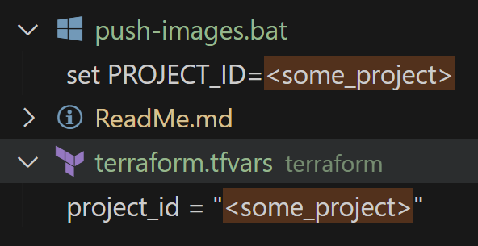
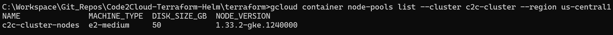
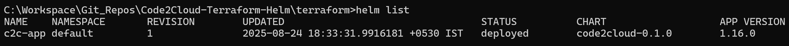

### Code2Cloud - Terraform - Helm

This Repository Demonstrates the following,

- Software Development of API with FastAPI & UI with Flask both in python.
- Containerization via Dockerfiles & Docker Compose to create Docker Images to check it locally.
- Selective creation of GCP Artifact Registry using Terraform IaC for storing the Containers.
- Execute Batch file to Push them to the Artifact Registry.
- Implement complete Infrastructure & Output the access point urls.

#### Initial setup

- search for **<some_project>**, to replace them with your gcp project. It needs to be changes in two files as shown below.



#### Software Development of API with FastAPI & UI with Flask both in python

##### API Development

- execute the following from **API/** folder.

```cmd

C:\Workspace\Git_Repos\Code2Cloud-Terraform-Helm\API>conda create -n c2c-api python=3.11.6
Channels:
 - conda-forge
Platform: win-64
Collecting package metadata (repodata.json): done
Solving environment: done


==> WARNING: A newer version of conda exists. <==
    current version: 24.9.0
    latest version: 25.7.0

Please update conda by running

    $ conda update -n base -c conda-forge conda


## Package Plan ##

  environment location: C:\Workspace\Softwares\Miniforge3\envs\c2c-api

  added / updated specs:
    - python=3.11.6


The following NEW packages will be INSTALLED:

  bzip2              conda-forge/win-64::bzip2-1.0.8-h2466b09_7
  ca-certificates    conda-forge/noarch::ca-certificates-2025.8.3-h4c7d964_0
  libexpat           conda-forge/win-64::libexpat-2.7.1-hac47afa_0
  libffi             conda-forge/win-64::libffi-3.4.6-h537db12_1
  liblzma            conda-forge/win-64::liblzma-5.8.1-h2466b09_2
  liblzma-devel      conda-forge/win-64::liblzma-devel-5.8.1-h2466b09_2
  libsqlite          conda-forge/win-64::libsqlite-3.50.4-hf5d6505_0
  libzlib            conda-forge/win-64::libzlib-1.3.1-h2466b09_2
  openssl            conda-forge/win-64::openssl-3.5.2-h725018a_0
  pip                conda-forge/noarch::pip-25.2-pyh8b19718_0
  python             conda-forge/win-64::python-3.11.6-h2628c8c_0_cpython
  setuptools         conda-forge/noarch::setuptools-80.9.0-pyhff2d567_0
  tk                 conda-forge/win-64::tk-8.6.13-h2c6b04d_2
  tzdata             conda-forge/noarch::tzdata-2025b-h78e105d_0
  ucrt               conda-forge/win-64::ucrt-10.0.22621.0-h57928b3_1
  vc                 conda-forge/win-64::vc-14.3-h41ae7f8_31
  vc14_runtime       conda-forge/win-64::vc14_runtime-14.44.35208-h818238b_31
  vcomp14            conda-forge/win-64::vcomp14-14.44.35208-h818238b_31
  wheel              conda-forge/noarch::wheel-0.45.1-pyhd8ed1ab_1
  xz                 conda-forge/win-64::xz-5.8.1-h208afaa_2
  xz-tools           conda-forge/win-64::xz-tools-5.8.1-h2466b09_2


Proceed ([y]/n)? y


Downloading and Extracting Packages:

Preparing transaction: done
Verifying transaction: done
Executing transaction: done
#
# To activate this environment, use
#
#     $ conda activate c2c-api
#
# To deactivate an active environment, use
#
#     $ conda deactivate


C:\Workspace\Git_Repos\Code2Cloud-Terraform-Helm\API>conda activate c2c-api

(c2c-api) C:\Workspace\Git_Repos\Code2Cloud-Terraform-Helm\API>python -m pip install -r reqs.txt
Collecting annotated-types==0.7.0 (from -r reqs.txt (line 1))
  Using cached annotated_types-0.7.0-py3-none-any.whl.metadata (15 kB)
Collecting anyio==4.10.0 (from -r reqs.txt (line 2))
  Using cached anyio-4.10.0-py3-none-any.whl.metadata (4.0 kB)
Collecting blessings==1.7 (from -r reqs.txt (line 3))
  Using cached blessings-1.7-py3-none-any.whl.metadata (19 kB)
Collecting click==8.2.1 (from -r reqs.txt (line 4))
  Using cached click-8.2.1-py3-none-any.whl.metadata (2.5 kB)
Collecting colorama==0.4.6 (from -r reqs.txt (line 5))
  Using cached colorama-0.4.6-py2.py3-none-any.whl.metadata (17 kB)
Collecting fastapi==0.116.1 (from -r reqs.txt (line 6))
  Using cached fastapi-0.116.1-py3-none-any.whl.metadata (28 kB)
Collecting h11==0.16.0 (from -r reqs.txt (line 7))
  Using cached h11-0.16.0-py3-none-any.whl.metadata (8.3 kB)
Collecting idna==3.10 (from -r reqs.txt (line 8))
  Using cached idna-3.10-py3-none-any.whl.metadata (10 kB)
Collecting lark==1.2.2 (from -r reqs.txt (line 9))
  Using cached lark-1.2.2-py3-none-any.whl.metadata (1.8 kB)
Collecting LogExAn==1.0.0 (from -r reqs.txt (line 10))
  Using cached LogExAn-1.0.0-py3-none-any.whl.metadata (11 kB)
Collecting numpy==2.3.2 (from -r reqs.txt (line 11))
  Using cached numpy-2.3.2-cp311-cp311-win_amd64.whl.metadata (60 kB)
Collecting pandas==2.3.2 (from -r reqs.txt (line 12))
  Using cached pandas-2.3.2-cp311-cp311-win_amd64.whl.metadata (19 kB)
Collecting pydantic==2.11.7 (from -r reqs.txt (line 13))
  Using cached pydantic-2.11.7-py3-none-any.whl.metadata (67 kB)
Collecting pydantic_core==2.33.2 (from -r reqs.txt (line 14))
  Using cached pydantic_core-2.33.2-cp311-cp311-win_amd64.whl.metadata (6.9 kB)
Collecting python-dateutil==2.9.0.post0 (from -r reqs.txt (line 15))
  Using cached python_dateutil-2.9.0.post0-py2.py3-none-any.whl.metadata (8.4 kB)
Collecting pytz==2025.2 (from -r reqs.txt (line 16))
  Using cached pytz-2025.2-py2.py3-none-any.whl.metadata (22 kB)
Collecting six==1.17.0 (from -r reqs.txt (line 17))
  Using cached six-1.17.0-py2.py3-none-any.whl.metadata (1.7 kB)
Collecting sniffio==1.3.1 (from -r reqs.txt (line 18))
  Using cached sniffio-1.3.1-py3-none-any.whl.metadata (3.9 kB)
Collecting starlette==0.47.2 (from -r reqs.txt (line 19))
  Using cached starlette-0.47.2-py3-none-any.whl.metadata (6.2 kB)
Collecting tabulate==0.9.0 (from -r reqs.txt (line 20))
  Using cached tabulate-0.9.0-py3-none-any.whl.metadata (34 kB)
Collecting typing-inspection==0.4.1 (from -r reqs.txt (line 21))
  Using cached typing_inspection-0.4.1-py3-none-any.whl.metadata (2.6 kB)
Collecting typing_extensions==4.14.1 (from -r reqs.txt (line 22))
  Using cached typing_extensions-4.14.1-py3-none-any.whl.metadata (3.0 kB)
Collecting tzdata==2025.2 (from -r reqs.txt (line 23))
  Using cached tzdata-2025.2-py2.py3-none-any.whl.metadata (1.4 kB)
Collecting uvicorn==0.35.0 (from -r reqs.txt (line 24))
  Using cached uvicorn-0.35.0-py3-none-any.whl.metadata (6.5 kB)
Using cached annotated_types-0.7.0-py3-none-any.whl (13 kB)
Using cached anyio-4.10.0-py3-none-any.whl (107 kB)
Using cached blessings-1.7-py3-none-any.whl (18 kB)
Using cached click-8.2.1-py3-none-any.whl (102 kB)
Using cached colorama-0.4.6-py2.py3-none-any.whl (25 kB)
Using cached fastapi-0.116.1-py3-none-any.whl (95 kB)
Using cached pydantic-2.11.7-py3-none-any.whl (444 kB)
Using cached starlette-0.47.2-py3-none-any.whl (72 kB)
Using cached h11-0.16.0-py3-none-any.whl (37 kB)
Using cached idna-3.10-py3-none-any.whl (70 kB)
Using cached lark-1.2.2-py3-none-any.whl (111 kB)
Using cached LogExAn-1.0.0-py3-none-any.whl (21 kB)
Using cached numpy-2.3.2-cp311-cp311-win_amd64.whl (13.1 MB)
Using cached pandas-2.3.2-cp311-cp311-win_amd64.whl (11.3 MB)
Using cached pydantic_core-2.33.2-cp311-cp311-win_amd64.whl (2.0 MB)
Using cached python_dateutil-2.9.0.post0-py2.py3-none-any.whl (229 kB)
Using cached pytz-2025.2-py2.py3-none-any.whl (509 kB)
Using cached six-1.17.0-py2.py3-none-any.whl (11 kB)
Using cached sniffio-1.3.1-py3-none-any.whl (10 kB)
Using cached tabulate-0.9.0-py3-none-any.whl (35 kB)
Using cached typing_inspection-0.4.1-py3-none-any.whl (14 kB)
Using cached typing_extensions-4.14.1-py3-none-any.whl (43 kB)
Using cached tzdata-2025.2-py2.py3-none-any.whl (347 kB)
Using cached uvicorn-0.35.0-py3-none-any.whl (66 kB)
Installing collected packages: pytz, tzdata, typing_extensions, tabulate, sniffio, six, numpy, lark, idna, h11, colorama, annotated-types, typing-inspection, python-dateutil, pydantic_core, click, blessings, anyio, uvicorn, starlette, pydantic, pandas, LogExAn, fastapi
Successfully installed LogExAn-1.0.0 annotated-types-0.7.0 anyio-4.10.0 blessings-1.7 click-8.2.1 colorama-0.4.6 fastapi-0.116.1 h11-0.16.0 idna-3.10 lark-1.2.2 numpy-2.3.2 pandas-2.3.2 pydantic-2.11.7 pydantic_core-2.33.2 python-dateutil-2.9.0.post0 pytz-2025.2 six-1.17.0 sniffio-1.3.1 starlette-0.47.2 tabulate-0.9.0 typing-inspection-0.4.1 typing_extensions-4.14.1 tzdata-2025.2 uvicorn-0.35.0

(c2c-api) C:\Workspace\Git_Repos\Code2Cloud-Terraform-Helm\API>python backend.py
INFO:     Will watch for changes in these directories: ['C:\\Workspace\\Git_Repos\\Code2Cloud-Terraform-Helm\\API']
INFO:     Uvicorn running on http://0.0.0.0:8000 (Press CTRL+C to quit)
INFO:     Started reloader process [2684] using StatReload
INFO:     Started server process [14712]
INFO:     Waiting for application startup.
INFO:     Application startup complete.
INFO:     127.0.0.1:54157 - "GET /docs HTTP/1.1" 200 OK
INFO:     127.0.0.1:54157 - "GET /openapi.json HTTP/1.1" 200 OK
INFO:     Shutting down
INFO:     Waiting for application shutdown.
INFO:     Application shutdown complete.
INFO:     Finished server process [14712]
INFO:     Stopping reloader process [2684]

```

##### UI Development

- execute the following from **UI/** folder.

```cmd

C:\Workspace\Git_Repos\Code2Cloud-Terraform-Helm\UI>conda create -n c2c-ui python=3.11.6
Channels:
 - conda-forge
Platform: win-64
Collecting package metadata (repodata.json): done
Solving environment: done


==> WARNING: A newer version of conda exists. <==
    current version: 24.9.0
    latest version: 25.7.0

Please update conda by running

    $ conda update -n base -c conda-forge conda


## Package Plan ##

  environment location: C:\Workspace\Softwares\Miniforge3\envs\c2c-ui

  added / updated specs:
    - python=3.11.6


The following NEW packages will be INSTALLED:

  bzip2              conda-forge/win-64::bzip2-1.0.8-h2466b09_7
  ca-certificates    conda-forge/noarch::ca-certificates-2025.8.3-h4c7d964_0
  libexpat           conda-forge/win-64::libexpat-2.7.1-hac47afa_0
  libffi             conda-forge/win-64::libffi-3.4.6-h537db12_1
  liblzma            conda-forge/win-64::liblzma-5.8.1-h2466b09_2
  liblzma-devel      conda-forge/win-64::liblzma-devel-5.8.1-h2466b09_2
  libsqlite          conda-forge/win-64::libsqlite-3.50.4-hf5d6505_0
  libzlib            conda-forge/win-64::libzlib-1.3.1-h2466b09_2
  openssl            conda-forge/win-64::openssl-3.5.2-h725018a_0
  pip                conda-forge/noarch::pip-25.2-pyh8b19718_0
  python             conda-forge/win-64::python-3.11.6-h2628c8c_0_cpython
  setuptools         conda-forge/noarch::setuptools-80.9.0-pyhff2d567_0
  tk                 conda-forge/win-64::tk-8.6.13-h2c6b04d_2
  tzdata             conda-forge/noarch::tzdata-2025b-h78e105d_0
  ucrt               conda-forge/win-64::ucrt-10.0.22621.0-h57928b3_1
  vc                 conda-forge/win-64::vc-14.3-h41ae7f8_31
  vc14_runtime       conda-forge/win-64::vc14_runtime-14.44.35208-h818238b_31
  vcomp14            conda-forge/win-64::vcomp14-14.44.35208-h818238b_31
  wheel              conda-forge/noarch::wheel-0.45.1-pyhd8ed1ab_1
  xz                 conda-forge/win-64::xz-5.8.1-h208afaa_2
  xz-tools           conda-forge/win-64::xz-tools-5.8.1-h2466b09_2


Proceed ([y]/n)? y


Downloading and Extracting Packages:

Preparing transaction: done
Verifying transaction: done
Executing transaction: done
#
# To activate this environment, use
#
#     $ conda activate c2c-ui
#
# To deactivate an active environment, use
#
#     $ conda deactivate


C:\Workspace\Git_Repos\Code2Cloud-Terraform-Helm\UI>conda activate c2c-ui

(c2c-ui) C:\Workspace\Git_Repos\Code2Cloud-Terraform-Helm\UI>python -m pip install -r reqs.txt
Collecting blessings==1.7 (from -r reqs.txt (line 1))
  Using cached blessings-1.7-py3-none-any.whl.metadata (19 kB)
Collecting blinker==1.9.0 (from -r reqs.txt (line 2))
  Using cached blinker-1.9.0-py3-none-any.whl.metadata (1.6 kB)
Collecting click==8.2.1 (from -r reqs.txt (line 3))
  Using cached click-8.2.1-py3-none-any.whl.metadata (2.5 kB)
Collecting colorama==0.4.6 (from -r reqs.txt (line 4))
  Using cached colorama-0.4.6-py2.py3-none-any.whl.metadata (17 kB)
Collecting contourpy==1.3.3 (from -r reqs.txt (line 5))
  Using cached contourpy-1.3.3-cp311-cp311-win_amd64.whl.metadata (5.5 kB)
Collecting cycler==0.12.1 (from -r reqs.txt (line 6))
  Using cached cycler-0.12.1-py3-none-any.whl.metadata (3.8 kB)
Collecting Flask==3.1.2 (from -r reqs.txt (line 7))
  Using cached flask-3.1.2-py3-none-any.whl.metadata (3.2 kB)
Collecting fonttools==4.59.1 (from -r reqs.txt (line 8))
  Using cached fonttools-4.59.1-cp311-cp311-win_amd64.whl.metadata (111 kB)
Collecting itsdangerous==2.2.0 (from -r reqs.txt (line 9))
  Using cached itsdangerous-2.2.0-py3-none-any.whl.metadata (1.9 kB)
Collecting Jinja2==3.1.6 (from -r reqs.txt (line 10))
  Using cached jinja2-3.1.6-py3-none-any.whl.metadata (2.9 kB)
Collecting kiwisolver==1.4.9 (from -r reqs.txt (line 11))
  Using cached kiwisolver-1.4.9-cp311-cp311-win_amd64.whl.metadata (6.4 kB)
Collecting lark==1.2.2 (from -r reqs.txt (line 12))
  Using cached lark-1.2.2-py3-none-any.whl.metadata (1.8 kB)
Collecting LogExAn==1.0.0 (from -r reqs.txt (line 13))
  Using cached LogExAn-1.0.0-py3-none-any.whl.metadata (11 kB)
Collecting MarkupSafe==3.0.2 (from -r reqs.txt (line 14))
  Using cached MarkupSafe-3.0.2-cp311-cp311-win_amd64.whl.metadata (4.1 kB)
Collecting matplotlib==3.10.5 (from -r reqs.txt (line 15))
  Using cached matplotlib-3.10.5-cp311-cp311-win_amd64.whl.metadata (11 kB)
Collecting numpy==2.3.2 (from -r reqs.txt (line 16))
  Using cached numpy-2.3.2-cp311-cp311-win_amd64.whl.metadata (60 kB)
Collecting packaging==25.0 (from -r reqs.txt (line 17))
  Using cached packaging-25.0-py3-none-any.whl.metadata (3.3 kB)
Collecting pandas==2.3.2 (from -r reqs.txt (line 18))
  Using cached pandas-2.3.2-cp311-cp311-win_amd64.whl.metadata (19 kB)
Collecting pillow==11.3.0 (from -r reqs.txt (line 19))
  Using cached pillow-11.3.0-cp311-cp311-win_amd64.whl.metadata (9.2 kB)
Collecting pyparsing==3.2.3 (from -r reqs.txt (line 20))
  Using cached pyparsing-3.2.3-py3-none-any.whl.metadata (5.0 kB)
Collecting python-dateutil==2.9.0.post0 (from -r reqs.txt (line 21))
  Using cached python_dateutil-2.9.0.post0-py2.py3-none-any.whl.metadata (8.4 kB)
Collecting pytz==2025.2 (from -r reqs.txt (line 22))
  Using cached pytz-2025.2-py2.py3-none-any.whl.metadata (22 kB)
Collecting six==1.17.0 (from -r reqs.txt (line 23))
  Using cached six-1.17.0-py2.py3-none-any.whl.metadata (1.7 kB)
Collecting tabulate==0.9.0 (from -r reqs.txt (line 24))
  Using cached tabulate-0.9.0-py3-none-any.whl.metadata (34 kB)
Collecting tzdata==2025.2 (from -r reqs.txt (line 25))
  Using cached tzdata-2025.2-py2.py3-none-any.whl.metadata (1.4 kB)
Collecting Werkzeug==3.1.3 (from -r reqs.txt (line 26))
  Using cached werkzeug-3.1.3-py3-none-any.whl.metadata (3.7 kB)
Using cached blessings-1.7-py3-none-any.whl (18 kB)
Using cached blinker-1.9.0-py3-none-any.whl (8.5 kB)
Using cached click-8.2.1-py3-none-any.whl (102 kB)
Using cached colorama-0.4.6-py2.py3-none-any.whl (25 kB)
Using cached contourpy-1.3.3-cp311-cp311-win_amd64.whl (225 kB)
Using cached cycler-0.12.1-py3-none-any.whl (8.3 kB)
Using cached flask-3.1.2-py3-none-any.whl (103 kB)
Using cached fonttools-4.59.1-cp311-cp311-win_amd64.whl (2.3 MB)
Using cached itsdangerous-2.2.0-py3-none-any.whl (16 kB)
Using cached jinja2-3.1.6-py3-none-any.whl (134 kB)
Using cached kiwisolver-1.4.9-cp311-cp311-win_amd64.whl (73 kB)
Using cached lark-1.2.2-py3-none-any.whl (111 kB)
Using cached LogExAn-1.0.0-py3-none-any.whl (21 kB)
Using cached MarkupSafe-3.0.2-cp311-cp311-win_amd64.whl (15 kB)
Using cached matplotlib-3.10.5-cp311-cp311-win_amd64.whl (8.1 MB)
Using cached numpy-2.3.2-cp311-cp311-win_amd64.whl (13.1 MB)
Using cached packaging-25.0-py3-none-any.whl (66 kB)
Using cached pandas-2.3.2-cp311-cp311-win_amd64.whl (11.3 MB)
Using cached pillow-11.3.0-cp311-cp311-win_amd64.whl (7.0 MB)
Using cached pyparsing-3.2.3-py3-none-any.whl (111 kB)
Using cached python_dateutil-2.9.0.post0-py2.py3-none-any.whl (229 kB)
Using cached pytz-2025.2-py2.py3-none-any.whl (509 kB)
Using cached six-1.17.0-py2.py3-none-any.whl (11 kB)
Using cached tabulate-0.9.0-py3-none-any.whl (35 kB)
Using cached tzdata-2025.2-py2.py3-none-any.whl (347 kB)
Using cached werkzeug-3.1.3-py3-none-any.whl (224 kB)
Installing collected packages: pytz, tzdata, tabulate, six, pyparsing, pillow, packaging, numpy, MarkupSafe, lark, kiwisolver, itsdangerous, fonttools, cycler, colorama, blinker, Werkzeug, python-dateutil, Jinja2, contourpy, click, blessings, pandas, matplotlib, Flask, LogExAn
Successfully installed Flask-3.1.2 Jinja2-3.1.6 LogExAn-1.0.0 MarkupSafe-3.0.2 Werkzeug-3.1.3 blessings-1.7 blinker-1.9.0 click-8.2.1 colorama-0.4.6 contourpy-1.3.3 cycler-0.12.1 fonttools-4.59.1 itsdangerous-2.2.0 kiwisolver-1.4.9 lark-1.2.2 matplotlib-3.10.5 numpy-2.3.2 packaging-25.0 pandas-2.3.2 pillow-11.3.0 pyparsing-3.2.3 python-dateutil-2.9.0.post0 pytz-2025.2 six-1.17.0 tabulate-0.9.0 tzdata-2025.2

(c2c-ui) C:\Workspace\Git_Repos\Code2Cloud-Terraform-Helm\UI>python frontend.py
 * Serving Flask app 'frontend'
 * Debug mode: on
WARNING: This is a development server. Do not use it in a production deployment. Use a production WSGI server instead.
 * Running on all addresses (0.0.0.0)
 * Running on http://127.0.0.1:5000
 * Running on http://192.168.68.105:5000
Press CTRL+C to quit
 * Restarting with stat
 * Debugger is active!
 * Debugger PIN: 143-885-638
127.0.0.1 - - [24/Aug/2025 15:56:52] "GET / HTTP/1.1" 200 -
127.0.0.1 - - [24/Aug/2025 15:56:52] "GET /static/css/bootstrap.min.css HTTP/1.1" 304 -
127.0.0.1 - - [24/Aug/2025 15:56:52] "GET /static/img/About.JPG HTTP/1.1" 304 -
127.0.0.1 - - [24/Aug/2025 15:56:52] "GET /static/js/bootstrap.min.js HTTP/1.1" 304 -

```

#### Containerization via Dockerfiles & Docker Compose to create Docker Images to check it locally

- execute the following in the **Code2Cloud-Terraform-Helm/** path of the repo.

```cmd

C:\Workspace\Git_Repos\Code2Cloud-Terraform-Helm>docker-compose up --build
Compose can now delegate builds to bake for better performance.
 To do so, set COMPOSE_BAKE=true.
[+] Building 22.2s (26/26) FINISHED                                                                                                                           docker:desktop-linux
 => [frontend internal] load build definition from Dockerfile                                                                                                                 0.0s
 => => transferring dockerfile: 614B                                                                                                                                          0.0s
 => [backend internal] load build definition from Dockerfile                                                                                                                  0.0s
 => => transferring dockerfile: 620B                                                                                                                                          0.0s
 => [backend internal] load metadata for docker.io/library/python:3.11-slim                                                                                                   2.1s
 => [frontend internal] load .dockerignore                                                                                                                                    0.0s
 => => transferring context: 2B                                                                                                                                               0.0s
 => [backend internal] load .dockerignore                                                                                                                                     0.0s
 => => transferring context: 2B                                                                                                                                               0.0s
 => [frontend base 1/9] FROM docker.io/library/python:3.11-slim@sha256:1d6131b5d479888b43200645e03a78443c7157efbdb730e6b48129740727c312                                       0.0s
 => [backend internal] load build context                                                                                                                                     0.0s
 => => transferring context: 644B                                                                                                                                             0.0s
 => [frontend internal] load build context                                                                                                                                    0.0s
 => => transferring context: 105.82kB                                                                                                                                         0.0s
 => CACHED [backend base 2/9] WORKDIR /app                                                                                                                                    0.0s
 => CACHED [backend base 3/9] RUN apt-get update && apt-get install -y dos2unix                                                                                               0.0s
 => [backend base 4/9] COPY reqs.txt .                                                                                                                                        0.0s
 => CACHED [frontend base 4/9] COPY reqs.txt .                                                                                                                                0.0s
 => CACHED [frontend base 5/9] RUN pip install --no-cache-dir -r reqs.txt                                                                                                     0.0s
 => CACHED [frontend base 6/9] RUN python -m pip install --no-cache-dir uvicorn gunicorn                                                                                      0.0s
 => [frontend base 7/9] COPY . .                                                                                                                                              0.1s
 => [backend base 5/9] RUN pip install --no-cache-dir -r reqs.txt                                                                                                            17.0s
 => [frontend base 8/9] RUN dos2unix run_flask.sh                                                                                                                             0.5s
 => [frontend base 9/9] RUN chmod +x run_flask.sh                                                                                                                             0.4s
 => [frontend] exporting to image                                                                                                                                             0.1s
 => => exporting layers                                                                                                                                                       0.1s
 => => writing image sha256:5f22e242e36c300ebe76618c25cbde229c5ddc4fa3f3539d889d071b631c2d73                                                                                  0.0s
 => => naming to docker.io/library/c2c-artifacts-frontend                                                                                                                     0.0s
 => [frontend] resolving provenance for metadata file                                                                                                                         0.0s
 => [backend base 6/9] RUN python -m pip install --no-cache-dir uvicorn gunicorn                                                                                              1.4s
 => [backend base 7/9] COPY . .                                                                                                                                               0.0s
 => [backend base 8/9] RUN dos2unix run_fastapi.sh                                                                                                                            0.4s
 => [backend base 9/9] RUN chmod +x run_fastapi.sh                                                                                                                            0.5s
 => [backend] exporting to image                                                                                                                                              0.7s
 => => exporting layers                                                                                                                                                       0.7s
 => => writing image sha256:0c2c5e3c02cb013f42587d5da8d61648e00792731780069035a0797667271ea3                                                                                  0.0s
 => => naming to docker.io/library/c2c-artifacts-backend                                                                                                                      0.0s
 => [backend] resolving provenance for metadata file                                                                                                                          0.0s
[+] Running 5/5
 ✔ backend                            Built                                                                                                                                   0.0s
 ✔ frontend                           Built                                                                                                                                   0.0s
 ✔ Network c2c-artifacts_app-network  Created                                                                                                                                 0.0s
 ✔ Container flaskui                  Created                                                                                                                                 0.1s
 ✔ Container fastapi                  Created                                                                                                                                 0.1s
Attaching to fastapi, flaskui
flaskui  | [2025-08-24 10:07:41 +0000] [7] [INFO] Starting gunicorn 23.0.0
flaskui  | [2025-08-24 10:07:41 +0000] [7] [INFO] Listening at: http://0.0.0.0:5000 (7)
fastapi  | [2025-08-24 10:07:41 +0000] [7] [INFO] Starting gunicorn 23.0.0
flaskui  | [2025-08-24 10:07:41 +0000] [7] [INFO] Using worker: sync
fastapi  | [2025-08-24 10:07:41 +0000] [7] [INFO] Listening at: http://0.0.0.0:8000 (7)
flaskui  | [2025-08-24 10:07:41 +0000] [8] [INFO] Booting worker with pid: 8
fastapi  | [2025-08-24 10:07:41 +0000] [7] [INFO] Using worker: uvicorn.workers.UvicornWorker
flaskui  | [2025-08-24 10:07:41 +0000] [9] [INFO] Booting worker with pid: 9
fastapi  | [2025-08-24 10:07:41 +0000] [8] [INFO] Booting worker with pid: 8
flaskui  | [2025-08-24 10:07:41 +0000] [10] [INFO] Booting worker with pid: 10
fastapi  | [2025-08-24 10:07:41 +0000] [9] [INFO] Booting worker with pid: 9
flaskui  | [2025-08-24 10:07:41 +0000] [49] [INFO] Booting worker with pid: 49
fastapi  | [2025-08-24 10:07:41 +0000] [10] [INFO] Booting worker with pid: 10
fastapi  | [2025-08-24 10:07:41 +0000] [11] [INFO] Booting worker with pid: 11
fastapi  | [2025-08-24 10:07:41 +0000] [8] [INFO] Started server process [8]
fastapi  | [2025-08-24 10:07:41 +0000] [8] [INFO] Waiting for application startup.
fastapi  | [2025-08-24 10:07:41 +0000] [8] [INFO] Application startup complete.
fastapi  | [2025-08-24 10:07:41 +0000] [9] [INFO] Started server process [9]
fastapi  | [2025-08-24 10:07:41 +0000] [9] [INFO] Waiting for application startup.
fastapi  | [2025-08-24 10:07:41 +0000] [9] [INFO] Application startup complete.
fastapi  | [2025-08-24 10:07:41 +0000] [11] [INFO] Started server process [11]
fastapi  | [2025-08-24 10:07:41 +0000] [11] [INFO] Waiting for application startup.
fastapi  | [2025-08-24 10:07:41 +0000] [11] [INFO] Application startup complete.
fastapi  | [2025-08-24 10:07:41 +0000] [10] [INFO] Started server process [10]
fastapi  | [2025-08-24 10:07:41 +0000] [10] [INFO] Waiting for application startup.
fastapi  | [2025-08-24 10:07:41 +0000] [10] [INFO] Application startup complete.
Gracefully stopping... (press Ctrl+C again to force)
[+] Stopping 2/2
 ✔ Container fastapi  Stopped                                                                                                                                                10.6s
 ✔ Container flaskui  Stopped                                                                                                                                                10.7s

```

#### Selective creation of GCP Artifact Registry using Terrafrom IaC for storing the Containers

- execute the following in the **terraform/** path of the repo.

```cmd

C:\Workspace\Git_Repos\Code2Cloud-Terraform-Helm\terraform>terraform apply -target=google_artifact_registry_repository.app_registry
google_project_service.iam: Refreshing state... [id=some_project/iam.googleapis.com]
google_project_service.gke: Refreshing state... [id=some_project/container.googleapis.com]
google_project_service.artifact_registry: Refreshing state... [id=some_project/artifactregistry.googleapis.com]
google_artifact_registry_repository.app_registry: Refreshing state... [id=projects/some_project/locations/us-central1/repositories/c2c-artifacts]

No changes. Your infrastructure matches the configuration.

Terraform has compared your real infrastructure against your configuration and found no differences, so no changes are needed.
╷
│ Warning: Resource targeting is in effect
│
│ You are creating a plan with the -target option, which means that the result of this plan may not represent all of the changes requested by the current configuration.
│
│ The -target option is not for routine use, and is provided only for exceptional situations such as recovering from errors or mistakes, or when Terraform specifically suggests
│ to use it as part of an error message.
╵
╷
│ Warning: Applied changes may be incomplete
│
│ The plan was created with the -target option in effect, so some changes requested in the configuration may have been ignored and the output values may not be fully updated. Run
│ the following command to verify that no other changes are pending:
│     terraform plan
│
│ Note that the -target option is not suitable for routine use, and is provided only for exceptional situations such as recovering from errors or mistakes, or when Terraform
│ specifically suggests to use it as part of an error message.
╵

Apply complete! Resources: 0 added, 0 changed, 0 destroyed.

```

#### Execute Batch file to Push them to the Artifact Registry

- execute the following in the **Code2Cloud-Terraform-Helm/** path of the repo.

```cmd

C:\Workspace\Git_Repos\Code2Cloud-Terraform-Helm>push-images.bat
Authenticating Docker with Artifact Registry...
WARNING: Your config file at [C:\Users\My PC\.docker\config.json] contains these credential helper entries:

{
  "credHelpers": {
    "us-central1-docker.pkg.dev": "gcloud"
  }
}
Adding credentials for: us-central1-docker.pkg.dev
gcloud credential helpers already registered correctly.
Tagging c2c-artifacts-backend:latest as us-central1-docker.pkg.dev/some_project/c2c-artifacts/backend:latest...
Pushing us-central1-docker.pkg.dev/some_project/c2c-artifacts/backend:latest to Artifact Registry...
The push refers to repository [us-central1-docker.pkg.dev/some_project/c2c-artifacts/backend]
d7386e5597c3: Pushed
fdbc46068cd2: Pushed
e9275e6c23db: Pushed
5353ab54b41e: Pushed
d387fbcb8574: Pushed
bd3c78b879bb: Pushed
a2761d0f7e02: Pushed
702fd99792bf: Pushed
41a3f3e0352a: Pushed
027e5044d8c1: Pushed
a0f52cec0ae9: Pushed
e6a3842ebc7f: Pushed
latest: digest: sha256:80ffe6d715e685ff2d0c2337070289d44d36412cfe2a8e1b745a3fb653f27e15 size: 2828
Tagging c2c-artifacts-frontend:latest as us-central1-docker.pkg.dev/some_project/c2c-artifacts/frontend:latest...
Pushing us-central1-docker.pkg.dev/some_project/c2c-artifacts/frontend:latest to Artifact Registry...
The push refers to repository [us-central1-docker.pkg.dev/some_project/c2c-artifacts/frontend]
490bfeebe32c: Pushed
9d2fa922780e: Pushed
1a552d0c5360: Pushed
7cb96e412787: Pushed
6bc57d8b7691: Pushed
3d0979aa3ee9: Pushed
a2761d0f7e02: Layer already exists
702fd99792bf: Layer already exists
41a3f3e0352a: Layer already exists
027e5044d8c1: Layer already exists
a0f52cec0ae9: Layer already exists
e6a3842ebc7f: Layer already exists
latest: digest: sha256:281fe7bf9e2348840c876facff4b64c82079ccb5072308007dd2c11e86546163 size: 2831
All images have been pushed successfully

```

#### Implement complete Infrastructure & Output the access point urls

- execute the following in the **terraform/** path of the repo.

```cmd

C:\Workspace\Git_Repos\Code2Cloud-Terraform-Helm\terraform>terraform apply
google_project_service.iam: Refreshing state... [id=some_project/iam.googleapis.com]
data.google_client_config.default: Reading...
data.google_client_config.default: Read complete after 0s [id=projects/some_project/regions/us-central1/zones/us-central1-c]
google_project_service.compute: Refreshing state... [id=some_project/compute.googleapis.com]
google_project_service.gke: Refreshing state... [id=some_project/container.googleapis.com]
google_project_service.artifact_registry: Refreshing state... [id=some_project/artifactregistry.googleapis.com]
google_compute_network.vpc_network: Refreshing state... [id=projects/some_project/global/networks/c2c-network]
google_compute_subnetwork.gke_subnet: Refreshing state... [id=projects/some_project/regions/us-central1/subnetworks/c2c-network-subnet]
google_compute_firewall.allow_internal: Refreshing state... [id=projects/some_project/global/firewalls/c2c-network-firewall]
google_container_cluster.gke_cluster: Refreshing state... [id=projects/some_project/locations/us-central1/clusters/c2c-cluster]
google_artifact_registry_repository.app_registry: Refreshing state... [id=projects/some_project/locations/us-central1/repositories/c2c-artifacts]
google_container_node_pool.primary_nodes: Refreshing state... [id=projects/some_project/locations/us-central1/clusters/c2c-cluster/nodePools/c2c-cluster-nodes]

Terraform used the selected providers to generate the following execution plan. Resource actions are indicated with the following symbols:
  + create
 <= read (data resources)

Terraform will perform the following actions:

  # data.kubernetes_service.multi_port_service will be read during apply
  # (depends on a resource or a module with changes pending)
 <= data "kubernetes_service" "multi_port_service" {
      + id     = (known after apply)
      + spec   = (known after apply)
      + status = (known after apply)

      + metadata {
          + generation       = (known after apply)
          + name             = "multi-port-service"
          + namespace        = "default"
          + resource_version = (known after apply)
          + uid              = (known after apply)
        }
    }

  # helm_release.my_app will be created
  + resource "helm_release" "my_app" {
      + atomic                     = false
      + chart                      = "../helm"
      + cleanup_on_fail            = false
      + create_namespace           = false
      + dependency_update          = false
      + disable_crd_hooks          = false
      + disable_openapi_validation = false
      + disable_webhooks           = false
      + force_update               = false
      + id                         = (known after apply)
      + lint                       = false
      + max_history                = 0
      + metadata                   = (known after apply)
      + name                       = "c2c-app"
      + namespace                  = "default"
      + pass_credentials           = false
      + recreate_pods              = false
      + render_subchart_notes      = true
      + replace                    = false
      + reset_values               = false
      + reuse_values               = false
      + set_wo                     = (write-only attribute)
      + skip_crds                  = false
      + status                     = "deployed"
      + timeout                    = 300
      + values                     = [
          + <<-EOT
                "api":
                  "image": "us-central1-docker.pkg.dev/some_project/c2c-artifacts/backend:latest"
                "ui":
                  "image": "us-central1-docker.pkg.dev/some_project/c2c-artifacts/frontend:latest"
            EOT,
        ]
      + verify                     = false
      + version                    = "0.1.0"
      + wait                       = true
      + wait_for_jobs              = false
    }

Plan: 1 to add, 0 to change, 0 to destroy.

Changes to Outputs:
  + service_urls = {
      + API = (known after apply)
      + UI  = (known after apply)
    }

Do you want to perform these actions?
  Terraform will perform the actions described above.
  Only 'yes' will be accepted to approve.

  Enter a value: yes

helm_release.my_app: Creating...
helm_release.my_app: Still creating... [00m10s elapsed]
helm_release.my_app: Still creating... [00m20s elapsed]
helm_release.my_app: Still creating... [00m30s elapsed]
helm_release.my_app: Still creating... [00m40s elapsed]
helm_release.my_app: Creation complete after 43s [id=c2c-app]
data.kubernetes_service.multi_port_service: Reading...
data.kubernetes_service.multi_port_service: Read complete after 1s [id=default/multi-port-service]

Apply complete! Resources: 1 added, 0 changed, 0 destroyed.

Outputs:

service_urls = {
  "API" = "http://external_ip:8000"
  "UI" = "http://external_ip:5000"
}

```

- Mapped Ip to Domain for ease of use, kindly use the link below for accessing the services.

| Service   | URL                                  |
|:----------|:-------------------------------------|
| API       | http://demowork.mywire.org:8000/docs |
| UI        | http://demowork.mywire.org:5000      |

#### Results

- gcloud container node-pools list --cluster c2c-cluster --region us-central1



- helm list -A

